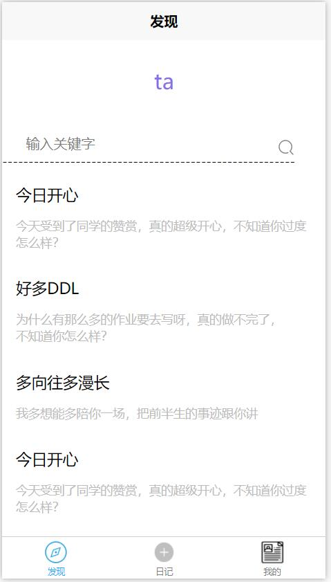

# exchange-journal_front-end

数据库期末Project，交换日记。

前端部分代码地址：<https://github.com/wu-kan/exchange-journal_front-end/>

## 项目人员及分工

按学号顺序排列。

|学号|姓名|分工|
|-|-|-|
|17341131|[彭继贤](https://github.com/shadw3002)|后端部分|
|17341155|[王永康](https://github.com/)|前端部分/发现、登陆、注册|
|17341163|[吴坎](https://github.com/wu-kan)|前端部分/写日记、个人中心|

## 项目目的

初步了解开发一款程序应用的基本流程，并初步熟悉开发程序应用所需的基本知识：前端和后端开发，并在其中了解数据库知识在其中的实际应用。

## 项目内容

开发一款写日记的APP，APP内容如下：

- 名字：交换日记（Exchange Journal）
- 主要功能：
  - 用户可以写日记，并发布
  - 两个用户随机配对
  - 配对的两个用户可以查看对方的日记

## 项目方案和流程

开发过程分为三个部分：前端开发，后端开发，前后端结合。

### 前端开发

我们的前端部分使用了[uni-app框架](https://uniapp.dcloud.io/)进行开发。它的好处和优势是一次编写，多平台发布（安卓app、IOSapp、H5页面、微信小程序、支付宝小程序、百度小程序、头条小程序、支付宝小程序）。

#### 界面预览

我们实现的App前端部分包含如下几个模块。

|  |  |  |
| ------------------------------------ | ---------------------------------------- | ---------------------------------------- |
| 发现                                 | 写日记                                   | 个人中心                                 |

应用启动后的第一页面是发现页，也是我们项目的核心功能。用户可以在发现页查看自己已经匹配的另一个用户的日志。对于初次注册尚未匹配的用户，它会看到的是匹配页面，可以看到一些其他用户的公开信息。

作为日记类应用，写日记是其最基本的功能，我在设计页面的时候希望尽可能的简洁，使得用户可以专注于自己要分享的内容。同时增加了日记心情、上传图片、图片压缩的功能，可以用于对日记做一些基础分类（未来用户数量足够多的时候，可以考虑对日记心情和文本内容做一些分析，从而更智能地为用户推送消息）。

最后是用户个人中心页面，由于目前还在一个很初级的版本，此处功能较少。未来可能会继续为其增加一些功能，如用户等级、用户相册、用户推荐、私信（目前是消息通知）、日记归档等等。

|  |  |  |
| ------------------------------------ | ------------------------------------ | -------------------------------------------- |
| 登陆                                 | 注册                                 | 日记详情                                     |

以上是这个app另一部分的界面，包含了一个简单的登陆/注册页面，以及包含评论私信模块的日记详情页面。

### 后端开发

- 后端部分代码地址：<https://github.com/wu-kan/exchange-journal_front-end/>

最初前后端交互想采用 python-grpc / grpc-web, 但是 grpc-web 有一些问题, 所以最后转移到了 Python 实现 http 服务器的方式.

目前的后端是这样实现的:
- 打开 server socket
- 接收一个连接请求
- 将新创建的 client socket 传给子线程
- 解析 http 请求包格式
- 从 url 解析调用的方法和参数
- 与 mysql 数据库进行交互
- 以 json 形式返回响应结果

```python
class HTTPServer(object):
    def __init__(self):
        pass

    def start(self):
        pass

    def handle_client(self, client_socket):
        pass

    def bind(self, port):
        pass
```

实现的接口的 rpc 描述为
```rpc
service MyDiary {
  // 获取自己或对方的文章数
  rpc GetPostNum(UserIDT) returns (PostNum) {}

  // 获取自己或对方的文章
  rpc GetPost(PostIDT) returns (Post) {}

  // 获取自己或对方的全部文章 ID
  rpc GetPostIDs(UserIDT) returns (stream PostID) {}
  
  // 获取对方的 ID
  rpc RequestPair(Token) returns (UserID) {}

  // 进行配对 TOOD
  rpc WantPair(Token) returns (Result) {}

  // 破坏配对 TODO
  rpc BreakPair(Token) returns (Result) {}

  // 
  rpc Login(LoginInfo) returns (Token) {}

  rpc UpdatePost(PostT) returns (PostID) {}
}
```

另外, 登陆机制的实现为:
- 用户登陆时, 服务器会产生一个随机的 token
- 用户随后使用这个 token 与服务器进行交互
- 服务器会在用户重新登陆后刷新这个 token, 服务器此外会定时刷新 token

## 项目结果

## 项目总结

## 参考文献
