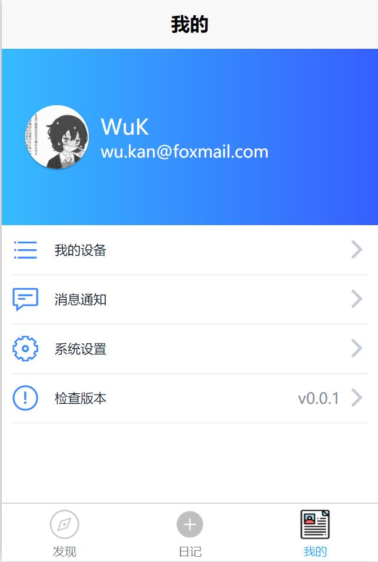

# exchange-journal_front-end

## 项目目的

初步了解开发一款程序应用的基本流程，并初步熟悉开发程序应用所需的基本知识：前端和后端开发，并在其中了解数据库知识在其中的实际应用。

## 项目内容

开发一款写日记的APP，APP内容如下：

- 名字：交换日记（RandNote）
- 主要功能：
  - 用户可以写日记，并发布
  - 两个用户随机配对
  - 配对的两个用户可以查看对方的日记

## 项目方案和流程

开发过程分为三个部分：前端开发，后端开发，前后端结合。

### 前端开发

### 后端开发

## 项目结果

数据库期末Project，交换日记前端部分。使用[uni-app框架](https://uniapp.dcloud.io/)，一次编写，多平台运行。

- 前端部分代码地址：<https://github.com/wu-kan/exchange-journal_front-end>
- 后端部分代码地址：<https://github.com/wu-kan/exchange-journal_front-end/>

## 界面预览

|  |  |  |
| ------------------------------------ | ---------------------------------------- | ---------------------------------------- |
| 发现                                 | 写日记                                   | 个人中心                                 |

|  |  |  |
| ------------------------------------ | ------------------------------------ | -------------------------------------------- |
| 登陆                                 | 注册                                 | 日记详情                                     |

## 项目总结

## 参考文献

|      |      |      |
|-|-|-|
|      |      |      |
